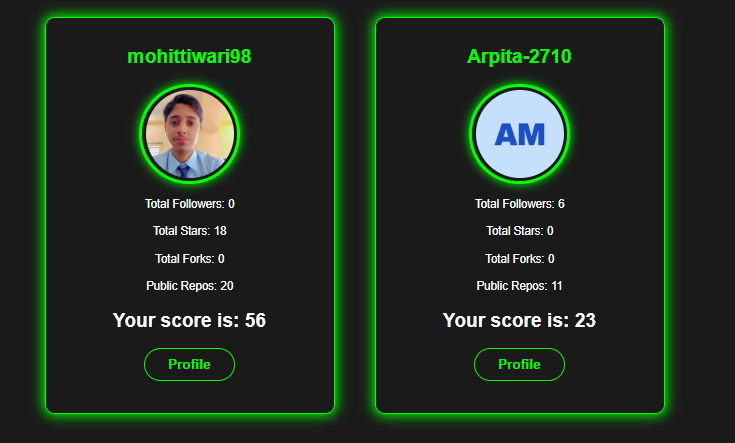

# Github-scorecard-and-compare

  

 
Overview
This project provides a tool to generate a "score" for any GitHub profile, allowing users to evaluate and compare their profiles (or others!) based on various public metrics. Whether you're a developer looking to improve your online presence, a recruiter assessing potential candidates, or just curious about how your profile stacks up, this tool offers a quantifiable way to gauge GitHub activity and influence.

  

Features
Customizable Scoring Logic: Define your own weights for different metrics (e.g., number of repositories, stars, followers, contributions).
Metric Analysis: Gathers key public data points from a GitHub profile, such as:
Number of public repositories
Total stars across all repositories
Number of followers
Number of users followed
Contribution streak/activity (e.g., commits, pull requests).

# 💻 Technology used:

        !
